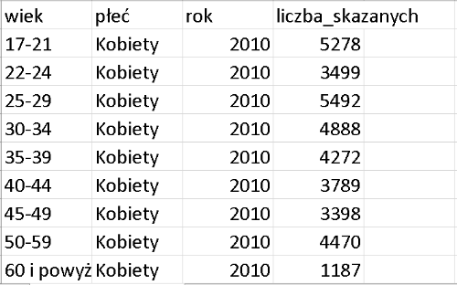

```{r setup, include=FALSE}
knitr::opts_chunk$set(echo = FALSE)
```


## Wykorzystane dane 


Wykorzystujemy dane ze strony *Glownego urzedu statycznego* [link](https://stat.gov.pl/download/gfx/portalinformacyjny/pl/defaultaktualnosci/6285/3/1/1/prawomocnie_skazane_osoby_dorosle.csv). Nasze dane przedstawiaja prawomocnie skazane osoby dorosle. Skazany to osoba fizyczna, która sad uznal winna popelnionego czynu i wymierzyl kare lub srodek karny. Skazany dorosły to osoba skazana, która w momencie popełnienia przestępstwa miała ukończone 17 lat.    

## Dane

Screen czesci naszych danych uzytych do projektu

{width=500px}


## Analiza wariancji, czyli ANOVA

**Analiza wariancja, ANOVA** jest jedną z najbardziej popularnych i najczęściej stosowanych analiz statystycznych. Metoda ta wyjaśnia, z jakim prawdopodobieństwem wyodrębnione czynniki mogą być powodem różnic między obserwowanymi średnimi grupowymi. 
<div class="cited"> Analiza wariancji została stworzona w latach dwudziestych przez Ronalda Fishera. </div>

Modele analizy wariancji dzielimy na:

- modele jednoczynnikowe 

- modele wieloczynnikowe

## Jednoczynnikowa analiza wariancji

W naszym projekcie uzylismy modelu jednoczynnikowego, jak sama nazwa wskazuje, mamy do czynienia tylko z jednym czynnikiem.
Chcemy sprawdzic, czy pojedynczy czynnik ma wpływ na mierzoną zmienną zależną.

Do analizy potrzebujemy:

zmienna zalezna - ilosciowa, numeryczna, w naszym przypadku jest to liczba skazanych 

zmienna niezalezna - grupująca (dzieli próbę na więcej niż dwie grupy), nominalna, w naszym przypadku sa to lata 2010-2018.

## Hipotezy

<div class="columns-2" style="width: 800px; color: Blue">


### Hipoteza zerowa

Srednie we wszystkich grupach sa rowne.


$$
\begin{aligned}
\ H_{0}:  \mu_{1} = \mu_{2} = (...) = \mu_{k} \\
\end{aligned}
$$


### Hipoteza alternatywna

Srednie pomiedzy grupami roznia sie istotnie.


$$
\begin{aligned}  
\ H_{1}: \mu_i ≠ \mu_i 
\end{aligned} 
$$  


</div>

## ANOVA - zalozenia


a) Wariancje w grupach są jednorodne 

b) Równoliczność obserwacji w podgrupach

c) Rozkład wyników w każdej grupie ma rozkład zbliżony do normalnego


## Statystyki ogolne 


```{r}
s <- read.csv("https://stat.gov.pl/download/gfx/portalinformacyjny/pl/defaultaktualnosci/6285/3/1/1/prawomocnie_skazane_osoby_dorosle.csv", row.names=NULL, sep=";", header=TRUE, colClasses=c("character","character","character","factor","numeric"))
s
```


```{r}

summary(s$liczba_skazanych)
```


## Histogram 

```{r}
data <- as.numeric(s$liczba_skazanych)
hist(data, col=rainbow(15), border = "darkblue", probability = T, main="Histogram ")
lines(density(data),col="black",lty="dotdash",lwd=3)
```


## Wykres pudelkowy

```{r}
boxplot(data,col="maroon", border="darkblue",horizontal = T)
```

## Srednie i wariancje 

Liczymy srednie i wariancje z kazdego roku. Uzywajac funkcji *tapply()*, *mean()* i *var()*


```{r, echo=T}
tapply(s$liczba_skazanych, s$rok, mean)
```


```{r, echo=T}
tapply(s$liczba_skazanych, s$rok, var)
```


## Wykres pudelkowy 

```{r}
boxplot(s$liczba_skazanych ~ s$rok,col="maroon", border="darkblue",pch = 15)
```


## Testy ANOVA (1)

Na poczatku sprawdzamy czy srednie sa sobie rowne, nie zakladajac rownosci wariancji. Uzywamy funkcji  *oneway.test()* 

```{r, echo=T}
oneway.test(s$liczba_skazanych ~ s$rok)
```

## Testy ANOVA (2)

Nastepnie sprawdzamy czy srednie  i wariancje sa rowne. Rowniez uzywajac *oneway.test* ale na koncu zmieniajac na *var.equal = T*


```{r, echo=T}
oneway.test(s$liczba_skazanych ~ s$rok, var.equal = T)
```


## Testy ANOVA (3)

W jednoczynnikowej analize wariancji modelujemy liczbe skazanych w zaleznosci od roku. Najpierw uzywamy *aov()* do uruchomienia modelu, potem *summary()* do wyswietlenia podsumowania operacji.

```{r, echo=T}
aov.out <- aov(s$liczba_skazanych ~ s$rok, data = s)
         summary(aov.out)
```


## Testy ANOVA (4)

**ANOVA** mowi nam, czy sa roznice miedzy srednimi grupowymi, ale nie mowi jakie sa roznice. Aby dowiedziec sie, ktore grupy sa statystycznie rozne od siebie, przeprowadzimy test post-hoc *TukeyHSD()*.

```{r,eval=F ,echo=T}
aov.out <- aov(s$liczba_skazanych ~ s$rok, data = s)
         TukeyHSD(aov.out)
```

</font>


## Testy ANOVA (4)

```{r}
aov.out <- aov(s$liczba_skazanych ~ s$rok, data = s)
         TukeyHSD(aov.out)
```


## Weryfikacja zalozen | Wariancje w grupach sa jednorodne 

Na koncu wykonujemy weryfikacje wczesniejszych zalozen. Wykonujemy test Bartletta *bartlett.test()* ktory sprawdza czy  wariancje w kazdej z grup są takie same.

```{r}
bartlett.test(s$liczba_skazanych ~ s$rok)
```


## Weryfikacja zalozen | Rozklad wynikow w każdej grupie ma rozklad zblizony do normalnego

Wykonujemy test Sharipo-Wilk *shapiro.test()* na sprawdzenie czy rozklad wynikow jest zblizony do normalnego w kazdej grupie

```{r}
 tapply(s$liczba_skazanych, s$rok, shapiro.test)
```

